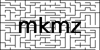

<br />
<div align="center">
  <a href="https://github.com/jcsq6/mkmz">
    
  </a>

  <p align="center">
    Png maze image generator.
  </p>
</div>

## About The Program

The goal of this program was to be able to generate mazes of any size as large as your computer can. This includes ridiculously large mazes. If you have a lot of memory, by all means, generate a 1,000,000*1,000,000 maze! The mazes are also very customizable, meaning that they don't have to be square. The same applies to the cell width and height-- the cells don't have to be square cells.


### Built With

mkmz is built with [CMake](https://cmake.org/)

This program depends on the following libraries.

* [libpng](http://www.libpng.org/pub/png/libpng.html)
* [zlib](https://zlib.net/)

### Prerequisites
* libpng  
  ```sudo apt-get install libpng-dev```
* zlib  
  ```sudo apt-get install zlib1g-dev```  

### Building

1. `mkdir build`
2. `cd build`
3. `cmake ..`  
4. `make`  

## Usage  
**mkmz [*options*]** 

***options:***  
* ```--help```  
*Display help information*  
* ```--log```  
*Create log of program output*  
* ```--replace```  
*Replace any file with the same name*  
* ```-o <FileName>```  
*Specify name of output file (***Optional***)*  
* ```-width <MazeWidth>```  
*Specify width of maze in cells.*  
* ```-height <MazeHeight>```  
*Specify height of maze in cells.*  
* ```-cwidth <CellWidth>```  
*Specify width of cells in pixels of resulting image.*  
* ```-cheight <CellHeight>```  
*Specify height of cells in pixels of resulting image.*  

## Contact

JC Squires - jcsq6inquires@gmail.com
