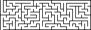

<br />
<div align="center">
  <a href="https://github.com/jcsq6/mkmz">
    
  </a>

  <p align="center">
    Png maze image generator.
  </p>
</div>

## About The Program

The goal of this program was to be able to generate mazes of any size as large as your computer can. This includes ridiculously large mazes. If you have a lot of memory, by all means, generate a 1,000,000*1,000,000 maze! The mazes are also very customizable, meaning that they don't have to be square. The same applies to the cell width and height-- the cells don't have to be square cells.

### Example Output  
<br />
<div align="center">
  <a href="https://github.com/jcsq6/mkmz">
    
  </a>
</div>

## Usage
**mkmz [*options*]** 

***options:***  
* ```-dims "<MazeWidth>, <MazeHeight>"```  
*Set the dimensions of the maze (required)*  
* ```-o [FileName]```  
*Specify name of output file (**Optional**)*  
* ```-cdims "[CELL WIDTH], [CELL_HEIGHT]"```  
*Set the dimensions in pixels of each cell in the maze (defaults to "1,1")*  
* ```-ww [WALL WIDTH]```  
*Set the width of the walls in pixels (defaults to 1)*  
* ```-wcol "[R], [G], [B], [A]"```  
*Set the color of the walls in rgba values ranged 0-255 (Defaults to "0, 0, 0, 255")*  
* ```-ccol "[R], [G], [B], [A]"```  
*Set the color of the cells in rgba values ranged 0-255 (Defaults to "255, 255, 255, 255")*  
* ```-o [MAZE NAME].png```  
*Sets the name of the resulting image (Defaults to [WIDTH]x[HEIGHT]_maze.png)*  
* ```-s [SEED]```  
*Sets the seed of the maze to be generated (Defaults to a random seed)*  
* ```--rb```  
*Use recursive backtracking algorithm (default)*  
*Recursive backtracking can be used for any size of maze, and is generally very fast*  
*Generates mazes with long corridors*
* ```--w```  
*Use Wilson's algorithm*  
*Wilsons' algorithm should only typically be used for small mazes, as it takes exponentially longer the larger the maze*  
*Generates mazes along a uniform distribution, leading to a good balance between different corridors*  
* ```--rd```  
*Use recursive division algorithm*  
*Fastest algorithm*  
*This algorithm is very fast for mazes of any size.*  
*Generates mazes with many box-like sub-groups*

# Notes
* ***You can generate as big a maze as your computer will allow.***  
* ***Any R, G, B colors that are ommitted will be set to 0, and any omitted A will be set to 255***
* ***The maze entrance for the recursive backtracking algorithm will always be (0,0), and the exit will be the farthest point on any wall from (0,0)***  
* ***The maze seed and other relevant info are put into the generated png's text chunks***  

### Built With

mkmz is built with [CMake](https://cmake.org/)

This program depends on the following libraries.

* [libpng](http://www.libpng.org/pub/png/libpng.html)
* [zlib](https://zlib.net/)

### Prerequisites
**Linux**
* libpng  
  `sudo apt-get install libpng-dev`
* zlib  
  `sudo apt-get install zlib1g-dev`  
  
**Windows (Vcpkg)**  
* libpng  
  `vcpkg install libpng:x64-windows-static` *For building a static x64 executable*  
* zlib  
  `vcpkg install zlib:x64-windows-static` *For building a static x64 executable*  

### Building
**Linux**
  1. `mkdir build`
  2. `cd build`
  3. `cmake ..`  
  4. `make` 
 
**Windows (Vcpkg)**
  1. `mkdir build`
  2. `cd build`
  3. `cmake -DCMAKE_TOOLCHAIN_FILE=C:\vcpkg\scripts\buildsystems\vcpkg.cmake -DVCPKG_TARGET_TRIPLET=x64-windows-static ..`
  4. `cmake --build .`